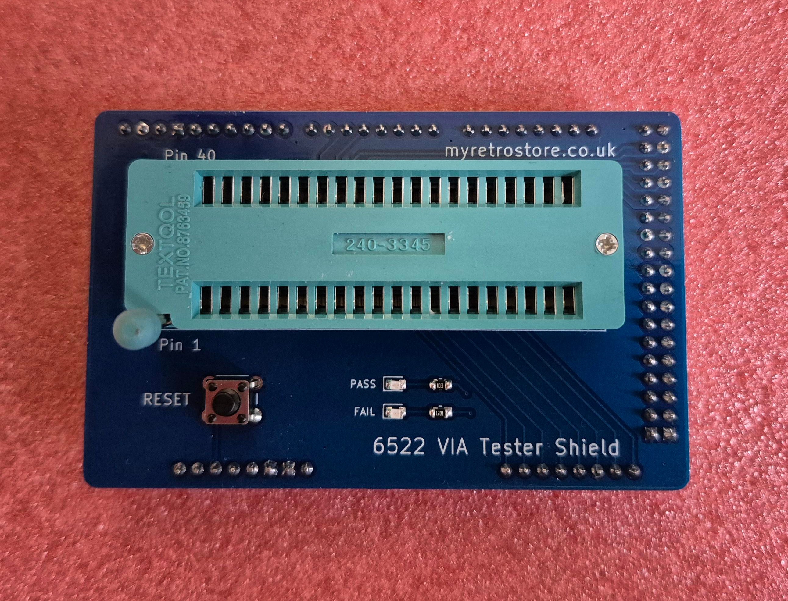

# 6522 Versatile Interface Adapter (VIA) Tester

A dedicated **6522 Versatile Interface Adapter (VIA) tester** for the **Arduino Mega 2560**, designed to test the functionality of 6522 VIA chips commonly found in classic computers such as the Commodore PET, Commodore VIC-20 ,Oric, Atari, BBC and others. 

The tester exercises the VIA's major functional blocks, including the CPU interface, I/O ports, timers, interrupts, control lines, and shift register.

The full 32-test sequence is repeated 10 times.




---

## What Does It Test?

### Bus & CPU Interface

* RESET behaviour
* 8-bit data bus read/write integrity
* Complete register address decoding
* Verification of all **16 VIA registers**

### I/O Ports — Port A & Port B

* Port output operation
* Input read-back
* Individual bit control on every I/O pin
* Port B input latching

### Timers

**Timer 1**

* Basic countdown and underflow
* Timer 1 latch and automatic reload
* One-shot output on **PB7**
* Free-running output on **PB7**

**Timer 2**

* Interval timing
* Pulse counting using **PB6**

### Interrupts

* Interrupt Enable Register (**IER**) set/clear operation
* Timer 1 interrupt generation
* CA1 interrupt flag
* CB1 interrupt flag
* CA2 interrupt flag
* CB2 interrupt flag
* Verification of the real **/IRQ** output line being asserted

### Handshake & Control Lines

**CA2 & CB2**

* Static level output — HIGH and LOW
* Handshake output mode
* Pulse output mode

### Shift Register

* Disabled state

  * Register remains accessible
  * No spurious interrupt generated
* Shift-out using an external **CB1 clock**
* Shift-out using **Timer 2**
* Shift-out using **PHI2**

---

## Hardware

The tester is implemented as an **Arduino Mega 2560 HAT/shield** with a ZIF socket for the 6522 VIA under test.

It is intended as a tool for testing and validating 6522 devices used in vintage and retro-computing hardware.


---

## Why Build a VIA Tester?

The 6522 is a highly integrated device containing several independent functional blocks. A simple continuity or register read/write test cannot verify all of its functionality.

This tester exercises the major interfaces and internal peripherals of the VIA, including:

* CPU bus interface
* Register decoding
* Digital I/O
* Input latching
* Timers
* Interrupt generation
* Handshake/control outputs
* Shift register operation
* `/IRQ` behaviour

This makes it useful for:

* Retro-computer repair
* Chip verification
* Hardware troubleshooting
* Vintage computer restoration
* Retro-computing hardware development

---

## Test Coverage

| Functional Area           |  Tests |
| ------------------------- | -----: |
| Bus & CPU Interface       |      4 |
| I/O Ports                 |      4 |
| Timers                    |      8 |
| Interrupts                |      7 |
| Handshake / Control Lines |      6 |
| Shift Register            |      3 |
| **Total**                 | **32** |

---

## Test Summary

| Metric                  |        Result |
| ----------------------- | ------------: |
| Functional tests        |        **32** |
| Consecutive full runs   |        **10** |
| Total successful checks | **320 / 320** |
| Result                  |      **PASS** |

---

## Project Status

**Working / Tested**

The current tester successfully completes the full 32-test suite and has been verified across multiple MOS6522 and W65C22 chips.

# Sample Output
Working 6522:
```
================================================
              6522 VIA TESTER
             myretrostore.co.uk

    https://github.com/MyRetroStore/6522-Tester
                Version: 1.0
================================================

Checking for 6522 VIA...

6522 VIA DETECTED.

================================================
                 FULL TEST
================================================

[ BUS ]
  RESET                   ... PASS
  DATA BUS                ... PASS
  REGISTER ADDRESSING     ... PASS

[ PORT A / PORT B ]
  PORT A OUTPUT           ... PASS
  PORT A INPUT            ... PASS
  PORT A INDIVIDUAL BITS  ... PASS
  PORT B OUTPUT           ... PASS
  PORT B INPUT            ... PASS
  PORT B INDIVIDUAL BITS  ... PASS
  PORT B INPUT LATCH      ... PASS

[ TIMERS ]
  TIMER 1                 ... PASS
  TIMER 1 LATCH           ... PASS
  TIMER 1 ONE-SHOT PB7    ... PASS
  TIMER 1 FREE-RUN PB7    ... PASS
  TIMER 2 INTERVAL        ... PASS
  TIMER 2 PB6 PULSE       ... PASS

[ INTERRUPTS ]
  IER                     ... PASS
  TIMER 1 IRQ             ... PASS
  CA1 INTERRUPT           ... PASS
  CB1 INTERRUPT           ... PASS
  CA2 INTERRUPT           ... PASS
  CB2 INTERRUPT           ... PASS

[ CA2 / CB2 ]
  CA2 STATIC OUTPUT       ... PASS
  CB2 STATIC OUTPUT       ... PASS
  CA2 HANDSHAKE           ... PASS
  CB2 HANDSHAKE           ... PASS
  CA2 PULSE OUTPUT        ... PASS
  CB2 PULSE OUTPUT        ... PASS

[ SHIFT REGISTER ]
  SHIFT DISABLED          ... PASS
  SHIFT OUT EXTERNAL CB1  ... PASS
  SHIFT OUT T2            ... PASS
  SHIFT OUT PHI2          ... PASS

================================================
                 TEST COMPLETE
================================================
Tests run:    32
Tests passed: 32
Tests failed: 0

================================================
                6522 PASS
================================================

================================================
       10-CYCLE RELIABILITY TEST
================================================

Cycle  1/10 ... PASS
Cycle  2/10 ... PASS
Cycle  3/10 ... PASS
Cycle  4/10 ... PASS
Cycle  5/10 ... PASS
Cycle  6/10 ... PASS
Cycle  7/10 ... PASS
Cycle  8/10 ... PASS
Cycle  9/10 ... PASS
Cycle 10/10 ... PASS

================================================
       RELIABILITY TEST COMPLETE
================================================
Cycles completed:       10
Tests per cycle:        32
Reliability executions: 320

Initial test executions: 32
Total executions:        320
Total passed:            320
Total failed:            0

================================================
          6522 PASS (ALL TESTS)
================================================
```
Bad 6522 Example 1:
```
================================================
              6522 VIA TESTER
             myretrostore.co.uk

    https://github.com/MyRetroStore/6522-Tester
                Version: 1.0
================================================

Checking for 6522 VIA...


================================================
             NO 6522 DETECTED
================================================

6522 did not respond to the tester.

Please check:
  - Correct orientation
  - No damaged or bent pins

Remove and reseat the 6522 and test again.

If the detection still fails, the 6522 may be faulty.
```
Bad 6522 Example 2:
```
================================================
              6522 VIA TESTER
             myretrostore.co.uk

    https://github.com/MyRetroStore/6522-Tester
                Version: 1.0
================================================

Checking for 6522 VIA...

6522 VIA DETECTED.

================================================
                 FULL TEST
================================================

[ BUS ]
  RESET                   ... PASS
  DATA BUS                ... PASS
  REGISTER ADDRESSING     ... PASS

[ PORT A / PORT B ]
  PORT A OUTPUT           ... FAIL
  PORT A INPUT            ... PASS
  PORT A INDIVIDUAL BITS  ... PASS
  PORT B OUTPUT           ... PASS
  PORT B INPUT            ... PASS
  PORT B INDIVIDUAL BITS  ... PASS
  PORT B INPUT LATCH      ... PASS

[ TIMERS ]
  TIMER 1                 ... PASS
  TIMER 1 LATCH           ... PASS
  TIMER 1 ONE-SHOT PB7    ... PASS
  TIMER 1 FREE-RUN PB7    ... PASS
  TIMER 2 INTERVAL        ... PASS
  TIMER 2 PB6 PULSE       ... PASS

[ INTERRUPTS ]
  IER                     ... PASS
  TIMER 1 IRQ             ... PASS
  CA1 INTERRUPT           ... PASS
  CB1 INTERRUPT           ... PASS
  CA2 INTERRUPT           ... PASS
  CB2 INTERRUPT           ... PASS

[ CA2 / CB2 ]
  CA2 STATIC OUTPUT       ... PASS
  CB2 STATIC OUTPUT       ... PASS
  CA2 HANDSHAKE           ... PASS
  CB2 HANDSHAKE           ... PASS
  CA2 PULSE OUTPUT        ... PASS
  CB2 PULSE OUTPUT        ... PASS

[ SHIFT REGISTER ]
  SHIFT DISABLED          ... PASS
  SHIFT OUT EXTERNAL CB1  ... PASS
  SHIFT OUT T2            ... PASS
  SHIFT OUT PHI2          ... PASS

================================================
                 TEST COMPLETE
================================================
Tests run:    32
Tests passed: 31
Tests failed: 1

================================================
                6522 FAIL
================================================

================================================
       10-CYCLE RELIABILITY TEST
================================================

  FAILED: PORT A OUTPUT
Cycle  1/10 ... FAIL
  FAILED: PORT A OUTPUT
Cycle  2/10 ... FAIL
  FAILED: PORT A OUTPUT
Cycle  3/10 ... FAIL
  FAILED: PORT A OUTPUT
Cycle  4/10 ... FAIL
  FAILED: PORT A OUTPUT
Cycle  5/10 ... FAIL
  FAILED: PORT A OUTPUT
Cycle  6/10 ... FAIL
  FAILED: PORT A OUTPUT
Cycle  7/10 ... FAIL
  FAILED: PORT A OUTPUT
Cycle  8/10 ... FAIL
  FAILED: PORT A OUTPUT
Cycle  9/10 ... FAIL
  FAILED: PORT A OUTPUT
Cycle 10/10 ... FAIL

================================================
       RELIABILITY TEST COMPLETE
================================================
Cycles completed:       10
Tests per cycle:        32
Reliability executions: 320

Initial test executions: 32
Total executions:        320
Total passed:            309
Total failed:            11

================================================
          6522 FAIL (ERRORS DETECTED)
================================================
```

